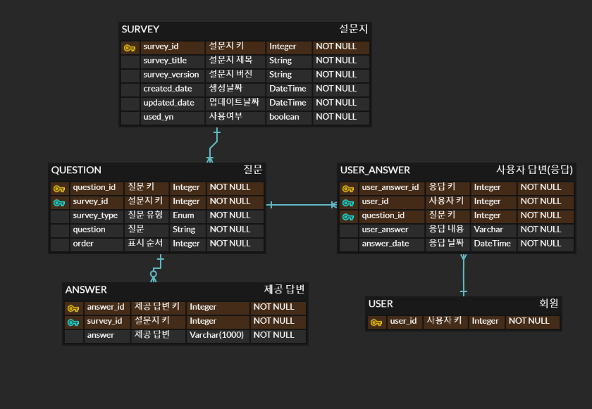

# Survey
- 설문조사를 관리할 수 있는 서버입니다.

- 잘못된 코드 습관을 올바르게 고치는 것이 목표입니다.

- 테스트에 대해서 집중해서 작성했습니다.  

<br>

## 🗂️ 프로젝트 사용기술
- [Spring Boot 3.4.4](https://spring.io/projects/spring-boot)
- [JDK 17](https://docs.oracle.com/en/java/javase/17/docs/api/index.html)
- [Gradle](https://gradle.org/)
- [H2](https://www.h2database.com/html/main.html)
- [JPA](https://spring.io/projects/spring-data-jpa)
- [Junit5](https://junit.org/junit5/)
- [Mapstruct](https://mapstruct.org/)
- Intellij

<br>

## 🗂️ 프로젝트 폴더 구조
멀티 모듈을 설정함으로 독립적으로 배포하고 코드의 중복을 제거, 재사용할 수 있게 진행했습니다.

빌드 로직, 작업 및 플로그인을 중앙 집중화 하는 `buildSrc`방식으로 진행했습니다.


```
📦 Survey
├─ buildSrc
│  ├─ src
│  │  └─ main
│  │     └─ groovy
│  │        └─ survey.java-conventions.gradle
│  └─ build.gradle
├─ survey-api
│  └─ build.gradle
├─ survey-common
│  └─ build.gradle
└─ suvey.domain
   └─ build.gradle
```
©generated by [Project Tree Generator](https://woochanleee.github.io/project-tree-generator)


**참고 문헌** 
- Gradle 공식 사이트https://docs.gradle.org/current/userguide/intro_multi_project_builds.html#sec:project_standard

<br>


## 🗂️ 프로젝트 관심사
- 클린코드를 위한 리팩토링을 계속적으로 진행했습니다.

- 테스트 코드를 집중적으로 진행했습니다. 

  - 통합 테스트: Mock 테스트, TestRestTemplate 테스트 

  - 유닛 테스트


<br>


### 📂Git-Flow 브랜치 전략
실서버에 올리지 않는 프로젝트로 realse, hotfix를 대신해서 multi, design 브랜치를 생성했습니다.

- master: 제품으로 출시될 수 있는 브랜치

- feature: 기능을 개발하는 브랜치

- design: 프로젝트의 구조를 잡을 때 사용할 임시 브랜치

- multi: 초반에 서버 세팅 시 사용할 임시 브랜치

<br>

## 🗂️ Issue
개발하면서 발생한 문제점이나, 알게 된 것을 정리한 것입니다. 업데이트 예정입니다.

<br>


## 🗂️ DB ERD


